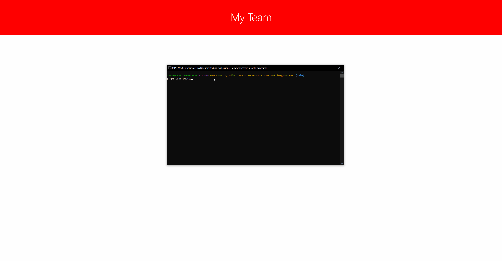

# team-profile-generator

## Description
This is a command line application that automatically generates an HTML page for your office team with all of the relevant information. It is a simple but powerful application that allows a team manager or other team member to gather all of the information in one place. By simply answering the prompts an HTML card will be generated for all of the chosen employees. Since all teams must have a leader, it starts by prompting the user to enter the information for the team's manager. Upon completing this the user is prompted to choose whether or not they would like to add another employee. Engineers and Interns top the list because there is typically only a single manager, but in case that the user would like to add another Manager that option is included as well. The User can add as many employees as they would like until they click decide to click none at which point all of the entered information will be written to an already formatted HTML file, in the dist file. Ready to go!

## Table of Contents
* [Preview](#Preview)
* [Installation](#Installation)
* [Packages](#Packages)
* [License](#License)
* [Contributing](#Contributing)
* [Questions](#Questions)

## Preview

## Installation
npm i

## Packages
* Inquirer
* Jest

## License

Copyright (c) [2022] [Vy Nguyen]

Permission is hereby granted, free of charge, to any person obtaining a copy of this software and associated documentation files (the "Software"), to deal in the Software without restriction, including without limitation the rights to use, copy, modify, merge, publish, distribute, sublicense, and/or sell copies of the Software, and to permit persons to whom the Software is furnished to do so, subject to the following conditions:

The above copyright notice and this permission notice shall be included in all copies or substantial portions of the Software.

THE SOFTWARE IS PROVIDED "AS IS", WITHOUT WARRANTY OF ANY KIND, EXPRESS OR IMPLIED, INCLUDING BUT NOT LIMITED TO THE WARRANTIES OF MERCHANTABILITY, FITNESS FOR A PARTICULAR PURPOSE AND NONINFRINGEMENT. IN NO EVENT SHALL THE AUTHORS OR COPYRIGHT HOLDERS BE LIABLE FOR ANY CLAIM, DAMAGES OR OTHER LIABILITY, WHETHER IN AN ACTION OF CONTRACT, TORT OR OTHERWISE, ARISING FROM, OUT OF OR IN CONNECTION WITH THE SOFTWARE OR THE USE OR OTHER DEALINGS IN THE SOFTWARE.

For more information, please visit: https://opensource.org/licenses/MIT

## Contributing
[Vy Nguyen](https://github.com/Vy187)

## Questions
If you have any questions about the repo, open an issue or contact me directly at vy1872@gmail.com